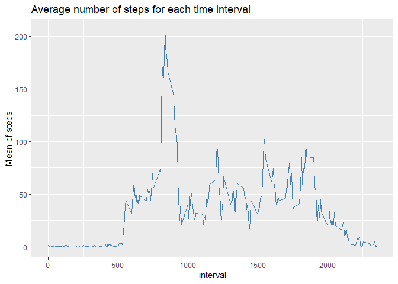

## Loading and preprocessing the data
Following code loads data file from project directory into an R data frame and preprocesses variable classes.


```r
library(dplyr, warn.conflicts=FALSE, verbose = FALSE, quietly = TRUE)
library(ggplot2)
library(tidyr)
library(reshape2, warn.conflicts=FALSE, verbose = FALSE, quietly = TRUE)

## load file as a data frame
rawDF <- read.csv("activity.csv", colClasses = c("numeric","Date","numeric"))
```

## What is mean total number of steps taken per day?  
A histogram plot is created to answer this question.

```r
## Calculate daily sums of steps for each day as a new data frame
        DailySumsDF <- as.data.frame( rawDF %>% group_by(date) %>%
                summarise(dailySteps=sum(steps, na.rm = TRUE)))

## Create a histogram of daily steps with ggplot 
       HistDailySteps <- ggplot(data=DailySumsDF, aes(x=dailySteps)) +
                geom_histogram(color="darkblue", fill="lightblue", binwidth = 200) +
                ggtitle("Histogram of number of steps taken each day")+
                xlab("Number of steps per day")+
                theme(plot.title = element_text(color="red", size=14, face="bold"))
       HistDailySteps
```

<!-- -->

```r
       ## create mean and median of dayly number of steps
       dailyMean <- mean(DailySumsDF$dailySteps)
       dailyMedian <- median(DailySumsDF$dailySteps)
```
Daily mean of the total steps taken is 9354.2295082 and the median is 1.0395\times 10^{4}.

## What is the average daily activity pattern?

```r
## Calculate average number of steps for each time interval as a new data frame
        StepsPerIntervalDF <- as.data.frame( rawDF %>% group_by(interval) %>%
                                          summarise(intervalMean=mean(steps,na.rm = TRUE)))
        
## create a plot of average number of steps for each time interval        
        StepsPerIntPlot <- ggplot(data=StepsPerIntervalDF, aes(x=interval, y=intervalMean))+ 
                geom_line(color="steelblue")+
                labs(title="Average number of steps for each time interval", y="Mean of steps")

        StepsPerIntPlot
```

<!-- -->

```r
# the interval with maximum mean value of steps
        MaxStepInterval <- StepsPerIntervalDF[StepsPerIntervalDF$intervalMean==max(StepsPerIntervalDF$intervalMean),"interval"]                
```

The interval 835 contains the maximum number of steps. 

## Imputing missing values


```r
##Number of missing values in dataframe denoted by NA        
        naCount <- sum(is.na(rawDF$steps))        
```
There were 2304 missing values in original data set.  

All the NAs were in steps column. I used average of the steps from existing data for each interval to fill the missing values.  Using following code a new data frame with new variable "ModSteps" is created.    


```r
 ## Create a new dataframe with NAs replaced by avarage for that interval
        ModDF <- rawDF %>%
                merge(StepsPerIntervalDF, by.y="interval")%>%
                arrange(date)%>%
                mutate(ModSteps=ifelse(is.na(steps),intervalMean,steps))
## Calculate daily sums of steps for each day with and without missing as a new data frame
        ModFinalDF <- as.data.frame( ModDF %>% group_by(date) %>%
                                summarise(dailySteps=sum(steps, na.rm = TRUE),ModDailySteps=sum(ModSteps)))
        xDF <- select(ModFinalDF, dailySteps, ModDailySteps)
        gg <- melt(xDF, measure.vars = c(1,2), value.name = "value")
        names(gg) <- c("variable", "steps")

## Create a histogram of daily steps from modified dataset with ggplot 
        HistDoublePlot <- ggplot(gg, aes(x=steps, fill=variable)) +
                geom_histogram(binwidth=200)+
                facet_grid(variable~.)+
                labs(title = "Histogram with and without filling missing data") 
        HistDoublePlot
```

<!-- -->

```r
## create mean and median of daily number of steps with modified dataset
        ModdailyMean <- mean(ModFinalDF$ModDailySteps)
        ModdailyMedian <- median(ModFinalDF$ModDailySteps)        
```

The mean and median of this modified data are mean= 1.0766189\times 10^{4} and median= 1.0766189\times 10^{4}  
Impact of filling of missing data with average seems to be minor.  

## Are there differences in activity patterns between weekdays and weekends?


```r
        myFunc <- function(x){
                ifelse((weekdays(x, abbreviate=TRUE) == "Sat" | 
                                weekdays(x, abbreviate=TRUE) == "Sun"), "WeekEnd", "WeekDay")
                       }
## new Data Frame factored with week and weekend days
        ModDayDF <- mutate(ModDF, Day=as.factor(myFunc(date))) 
        
        myGrSumDF <- as.data.frame(ModDayDF %>% 
                        select(date, Day, interval, ModSteps)%>% 
                        group_by(Day, interval)%>% 
                        summarise(AverageSteps=mean(ModSteps)))
        
        panelPlot <- ggplot(data=myGrSumDF, aes(x=interval, y=AverageSteps, color=Day, group=Day)) + 
                geom_line()+
                labs(title="Average steps for each time interval")+
                facet_grid(Day ~ .)
                
        panelPlot
```

<!-- -->

From the plot above there seems to be difference in activity patterns between weekdays and weekends.


